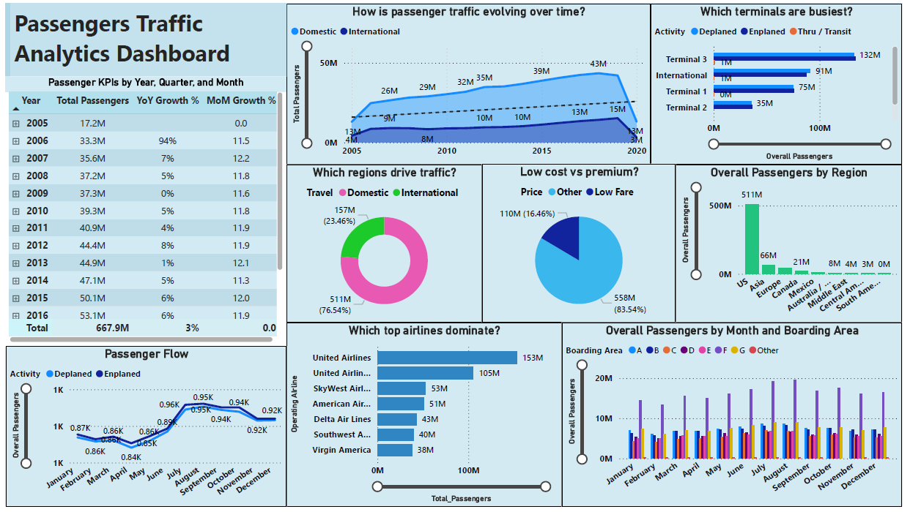
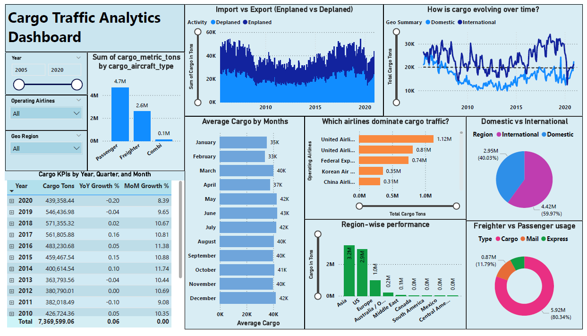

# Airport Traffic Analytics (Passenger &amp; Cargo Insights)
This project analyzes airport passenger and cargo traffic patterns, airline performance, and operational trends using a dataset covering airport activity from 2005 to 2018. The objective is to identify traffic growth patterns, evaluate airline dominance, and generate actionable insights to support airport planning and operational decision-making.
The project demonstrates how data can be used to enhance:
- Passenger traffic monitoring and forecasting 
-	Airline performance and market share analysis 
-	Cargo movement and logistics insights 
-	Airport operations and capacity planning
  
This project demonstrates an end-to-end data analytics workflow using Power BI and DAX, including data modeling, KPI development, and interactive dashboard creation.

## 📁 Dataset & Source
-	Source: Kaggle – San Francisco International Airport Monthly Air Cargo & Passenger Statistics (https://www.kaggle.com/datasets/rajsengo/sfo-air-traffic-passenger-and-cargo-statistics/data)
-	License: Open Data Commons PDDL (Public Domain)
-	Time Period: 2005 – 2018 
-	Purpose: Used for learning and building passenger and cargo analytics dashboards 
-	Note: Dataset used strictly for educational purposes without modification

## 📊 Dashboard Structure
- Page 1: Passengers Traffic Analytics
- Page 2: Cargo Traffic Analytics

## 🎯 BUSINESS QUESTIONS

## ✈️ Passenger Dashboard Questions
1.	How is passenger traffic trending over time? 
2.	Which regions contribute most to passenger traffic? 
3.	Which airlines dominate passenger traffic? 
4.	Which terminals handle the highest passenger load? 
5.	What is the distribution between domestic and international traffic? 
6.	What is the behavior of passenger activity (enplaned vs deplaned)? 
7.	Which boarding areas are most utilized? 
8.	What is the share of low-cost vs premium passengers? 

## 📦 Cargo Dashboard Questions
1.	How is cargo traffic trending over time? 
2.	Which airlines dominate cargo transportation? 
3.	What is the distribution between domestic and international cargo? 
4.	What is the share of cargo vs mail? 
5.	Which aircraft types carry the most cargo? 
6.	What is the import vs export (enplaned vs deplaned) pattern? 
7.	Which regions contribute most to cargo traffic? 
8.	How does cargo vary seasonally (monthly trend)? 

## 📊 PASSENGER DASHBOARD INSIGHTS

### 📌 1. KPIs
-	Total Passengers: 667.9 Million 
-	YoY Growth: 3% 
-	MoM Growth: 0%
  
👉 Insight
-	Passenger traffic is growing steadily (+3%), indicating a healthy aviation market. 
-	0% MoM growth suggests short-term stability, with no immediate acceleration in recent periods.

### 📈 2. Trend Analysis (Line Chart)
-	Domestic: 13M → 43M (2005–2018) 
-	International: 4M → 15M (2005–2018) 
-	After 2018: International declining
  
👉 Insight
-	Domestic traffic shows consistent and sustained expansion, highlighting strong internal travel demand. 
-	The post-peak decline in international traffic suggests external pressures or shifting travel patterns, indicating potential market sensitivity.
  
### ✈️ 3. Terminal Performance
-	Terminal 3: 132M (highest) 
-	International: 91M 
-	Terminal 1: 75M 
-	Terminal 2: 35M 

👉 Insight
-	Traffic is highly concentrated in Terminal 3, indicating potential capacity constraints and operational pressure. 
-	Uneven distribution suggests opportunities for better load balancing across terminals.

### 🌍 4. Regional Distribution
-	Domestic: 511M (76.54%) 
-	International: 157M (23.46%)
  
👉 Interpretation:
-	Airport is domestic-heavy 
-	International traffic is significant but secondary 

### 💰 5. Fare Category
-	Low Fare: 110M (16.46%) 
-	Other: 558M (83.54%)
  
👉 Insight:
-	A large proportion of passengers fall into non-low-cost segments, suggesting a stronger presence of full-service or premium travel demand. 
-	Indicates potential for higher revenue per passenger.

### 🌍 6. Regional Contribution
-	US: 511M 
-	Asia: 66M 
-	Europe: 21M
  
👉 Interpretation:
- US dominates traffic 
-	Asia & Europe contribute but are minor segments 

### ✈️ 7. Top Airlines
-	United Airlines: 153M 
-	United Pre-2013: 105M 
-	SkyWest: 53M 
-	American: 51M 
-	Delta: 43M
  
👉 Insight:
-	Passenger traffic is dominated by a few key airlines, with United Airlines holding a leading position. 
-	This indicates market concentration, which may impact competition and dependency.

### 📊 8. Boarding Area
-	Boarding Area F: ~20M peak (June–August) 
-	Others: 5M–9M
  
👉 Interpretation:
-	Boarding Area F is the busiest and most critical hub 
-	Seasonal spikes indicate summer travel demand 

### 🔄 9. Activity Flow
-	Enplaned > Deplaned 
-	Increasing trend May–Dec 
-	Decreasing Jan–Apr
  
👉 Interpretation:
-	Airport experiences more departures than arrivals 
-	Seasonal fluctuations are evident 

## 📦 CARGO DASHBOARD INSIGHTS

### 📌 1. KPIs
-	Total Cargo: 7,369,599 Tons 
-	YoY Growth: 6% 
-	MoM Growth: 0%
  
👉 Insight:
-	Cargo traffic is growing at a faster rate than passenger traffic, highlighting increasing importance of logistics operations. 
-	Stable MoM indicates consistent short-term cargo movement.

### ✈️ 2. Aircraft Type
-	Passenger Aircraft: 4.7M (dominant) 
-	Freighter: 2.6M 
-	Combo: 0.1M
  
👉 Insight:
-	A significant portion of cargo is transported via passenger aircraft, reflecting operational efficiency through dual-use capacity. 
-	Freighters remain essential for bulk cargo handling.

### 🔄 3. Import vs Export
-	Enplaned: 
  -	Peaks >40K (2005–2009, 2016–2019) 
-	Deplaned: 
  -	Stable around 20K with fluctuations
    
👉 Insight:
-	Cargo movement exhibits cyclical patterns, indicating sensitivity to trade demand and economic conditions. 
-	Export (enplaned) volumes tend to be higher, suggesting strong outbound logistics activity.

### 🌍 4. Domestic vs International
-	Domestic: 2.95M (40.03%) 
-	International: 4.42M (59.97%)
  
👉 Insight:
-	Cargo traffic is primarily international, reflecting the airport’s role in global trade networks. 
-	This contrasts with passenger traffic, showing different operational drivers.

### ✈️ 5. Top Cargo Airlines
-	United: 1.12M 
-	United Pre-2013: 0.81M 
-	FedEx: 0.74M 
-	Korean Air: 0.35M 
-	China Airlines: 0.31M
  
👉 Insight:
-	Cargo operations are concentrated among key carriers, including both passenger and dedicated freight airlines. 
-	Indicates reliance on strategic airline partnerships.

### 📦 6. Cargo Type
-	Cargo: 5.92M (80.34%) 
-	Mail: 0.87M (11.79%) 
-	Express: 0.58M (7.86%)
   
👉 Insight:
-	Standard cargo dominates, indicating traditional freight demand outweighs express logistics. 
-	Express segment, while smaller, represents a growing niche market.

### 🌍 7. Regional Cargo
-	Asia: 3.2M (largest) 
-	US: 2.9M 
-	Europe: 1M 
-	Australia: 0.2M
  
👉 Insight:
-	Asia is the leading contributor, reflecting strong international trade connectivity.
-	Indicates strong international trade flow 

### 📊 8. Monthly Cargo
-	May–Dec: 40K–42K 
-	Jan–Apr: 35K–37K
  
👉 Insight:
-	Cargo activity shows seasonal variation, with higher volumes in mid-to-late year. 
-	Indicates need for seasonal capacity planning.

## 📌 CONCLUSION
-	Passenger traffic is domestic-driven, while cargo is international-driven 
-	Both sectors show steady long-term growth 
-	Top airlines dominate both passenger and cargo traffic 
-	Strong seasonality patterns are observed 
-	Terminal and boarding area usage shows operational concentration 

## 📌 BUSINESS ANSWERS
-	Airport should expand high-demand terminals (Terminal 3) 
-	Airlines like United dominate traffic → key partnerships 
-	Cargo growth indicates increasing global trade importance 
-	Boarding Area F is a critical operational zone 
-	International cargo should be prioritized due to higher contribution 

## 📌 RECOMMENDATIONS
-	Expand capacity in Terminal 3 and Boarding Area F 
-	Strengthen partnerships with top airlines 
-	Invest in cargo infrastructure due to growth (+6%) 
-	Focus on international routes (higher cargo share) 
-	Improve seasonal planning for peak months 
-	Optimize slot utilization and scheduling 

## 💻 TECHNICAL STACK
-	Power BI (Dashboard creation) 
-	DAX (KPI calculations) 
-	Data Modeling (relationships, Date table) 
-	Data Visualization 

## 🚀 FINAL NOTE
👉 This project demonstrates:
-	Data analysis skills 
-	Business insight generation 
-	Dashboard storytelling 
-	KPI tracking 

